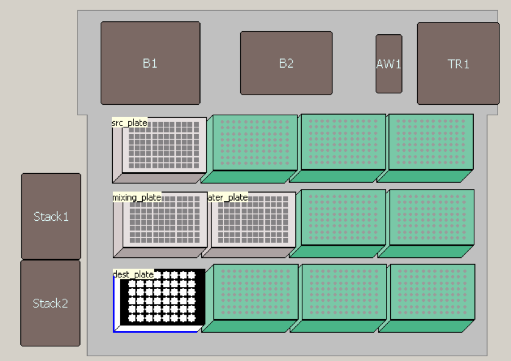

# Running the Combinatorial Media Pipeline
This repository contains the code required to compile a media specification into liquid handler instruction csvs compatable with a BioMek NXP robot.  This code is used to realize an automated Design Build Test Learn \[DBTL\] cycle for media optimization.  In this file I explain how to use this code in conjunction with robots to complete a DBTL cycle which optimizes media for a particular bioproduct producing strain. The whole process is visualized below:


For the remiander of the document we will refer to each step by its number and discuss how to conduct each one.

## 1. Defining The Initial Media
If this is the first cycle, media must either be prespecified or created using the create initial media function. In either case the first step is to create a media specification csv file.  This file contains a list of all possible media components along with the range of possible concentrations and the stock solution concentration. This defines a sample media phase space. An example is provided below with just two media components.  This example will not grow any microorganisms, but is provided to show how the software functions. So, please do not use this example for production.

> **_NOTE:_**  The headers must be spelled identically as above in order to work properly

> **_NOTE:_**  Glucose is specified in percent below, as a result 40% Glucose is written as 0.04.

| Media Components | Master Solution Concentration \[M\] | Min Concentration \[mM\] | Max Concentration \[mM\]
|---------|----|----|----|
| Glucose |0.04|   0|   5|
| Na2HPO4 |  1 |  10|  30|   


This file which we call 'example_stock_solutions.csv' is used to create a set of initial media compositions using the function below. In the case below we choose to create only two intial media variants.


```python 
import media_compiler as mc
df = mc.generate_initial_media('example_stock_solutions.csv')
```

This dataframe can then be directly used for downstream steps or exporeted as a csv for future use. If we choose to continue the dataframe can then be compiled into a set of instructions that are readable to the BioMek NxP platform. 

## 2. Generating Machine Readable BioMek NxP Instructions

In order to generate instuctions the input is a dataframe that looks like below.  The first two columns must be Plate and Well.  The last two columns are Volume and Target. The middle columns correspond to media components.

> **_Todo:_** Add units to columns and explain units better.


| Plate       |   Well |      Glucose |   Na2HPO4 |   Volume | Target   |
|:------------|-------:|-------------:|----------:|---------:|:---------|
| src_plate   |      1 | 40           |    0      |     1000 | False    |
| src_plate   |      2 |     0        | 1000      |     1000 | False    |
| water_plate |      1 |     0        |    0      |     1600 | False    |
| water_plate |      2 |     0        |    0      |     1600 | False    |
| water_plate |      3 |     0        |    0      |     1600 | False    |
| water_plate |      4 |     0        |    0      |     1600 | False    |
| dest_plate  |      1 |     3.56712  |   14.8981 |     1100 | True     |
| dest_plate  |      9 |     3.56712  |   14.8981 |     1100 | True     |
| dest_plate  |     17 |     3.56712  |   14.8981 |     1100 | True     |
| dest_plate  |      2 |     0.265235 |   30.5683 |     1100 | True     |
| dest_plate  |     10 |     0.265235 |   30.5683 |     1100 | True     |
| dest_plate  |     18 |     0.265235 |   30.5683 |     1100 | True     |

> **_NOTE:_**  The above dataframe must have the indecies set to Plate and Well .

```python
df = df.set_index(['Plate','Well'])
mc.compile_media(df)
```

Running that command generates a set of csvs inside of the biomek_files directory. Now that the csvs are generated they can be used to create combinatorial media on the BioMek NxP platform.

## 3. Synthesize Media on the BioMek NxP Platform

> **_Point of Contact:_**  Tad Ogorzalek.  Tad will know how to get access to the BioMek Remotely and Transfer Files.  I will not explicitly cover the use of these machines here, but instead leave it to Tad to instruct you on the details.

> **_Note:_** I reccomend for anyone running this protocol to have Tad look over your work as you work with the biomek the first time.

> **_NOTE:_**  The current protocol only runs to completion without supervision when there are less than 13 Media Components.  There is a version of the protocol which allows for manual tip replacement during the process but this is more laborius.


In this step we synthesize all of the media required one plate must be created for each round of adaptation and/or production. Currently we use one adaptation round and one production round of fermentation, so two plates must be created. In order to synthesize one plate of media the following reagents are required.

- 3 Costar Deep Well Plates
- 1 BioMek Flower Plate
- 8 Plates of 200uL Robotic Tips
- Stock solutions for all Specified Media Components

> **_Error Source (Stock Solution Creation):_** Stock Solutions are made by hand.  There is human measurement error associated with each stock solution.  When making these attempt to be as accurate as possible and consider only measuring quantites in excess of 1 gram, and diluting your solution down to the correct concentration if possible. At lower than 1 gram as much as 50% error can be normal making stock solutions highly variable. This error is particularly insidious because stock solutions are made only occasionally so the error is only noticed once the solution is changed.  A Gold standard would be making a 3rd plate and running it through some form of chromotography.


There is both a lab component and electronic component to this protocol.

1. [Lab] Fill up one of the deep well plates As specified by the dataframe used in step 2.  Using the example above Well 1 of the source plate would be filled with 1000 uL of 40% Glucose Solution and Well 2 would be filled with 1000 uL Na2HP04 stock solution.  Its a good idea to put more volume than is specified. I usually add 1200 uL.

2. [Lab] Fill up a Costar Deep Well Plate 1700 uL of Water in each well. If you want to save time and there are only a few wells needed you can only fill up the wells specified from the deck dataframe generated in step 1.

3. [Electronic] Copy the following files, generated in step 2, from your local machine to the biomek NxP computer to C:\Users\jbei\Documents\ZakCostello\CombinatorialMedia\RUN: 
    * dest.csv
    * mix.csv
    * src.csv
    * water_dest.csv
    * water_mix.csv
    
    a. First Login to the BioMek NxP server.  Credentials and setup can be acquired from Tad.
    
    
    b. Next Upload the specified Files. This is illustrated in the next three images. After the file upload the experimental protocol will be correctly configured. 
    
    
    
    


4. [Lab] Set up the Deck as specified in the image below where the stock solution plate is in the first position in the to left.



5. [Electronic] Once the deck is configured Home all axes and simulate or run the protocol. For detailed instructions on this see Tad.

> **_NOTE:_**  In order to open the protocol it is in a password protected directory. The password is: z@k!

### Finishing the Media Plate
The Media Plate May need to be finished in order to move to the next step and do fermentation. Specifically, adding antibiotic, which is reccomended due to the fact that sterile conditions are hard to maintain in the robotics lab during the media creation process. Inducer needs to be added in the case of production. Innoculation is currently done by hand, either from an overnight culture on the first adaptation plate or from the previous plate. 

> **_NOTE:_**  For the Indigoidine Experiment, the antibiotic is chloramphenicol [CM] . It is made in 1000x stock.  So if you have 1000uL of media add 1uL of CM stock.

> **_NOTE:_**  For the Indigoidine Experiment, in order to finish the plate Arabinose is added as the inducer.  Arabinose should account for 0.3% the final solution. 


## 4. Performing Fermentations Using the Biolector

> **_Point of Contact:_**  Tad Ogorzalek. Tad knows all the details of Biolector use and Maintenence. For detailed use of the biolector please ask Tad and get training on how to use this machine correctly.

1. Create 3 biological replicates of an overnight culture of the strain to be tested.

    a. First create 4 culture tubes by adding 5mL of LB media with chloramphenicol to each tube.
    
    b. In the first three tubes, innoculate with a single colony of the desired strain.  Do this by touching a pipette tip to the colony of interest and then dropping it in the tube. In the fourth tube leave it as is as a negative control.
    
    c. Incubate overnight in the 30 degree warm room in the case of pseudomonas 
    putida.

2. Innoculate the Adaptation plate With the completed overnight culture. Columns A and D are innoculated with replicate 1, Columns B and E are innoculated with replicate 2, and Columns C and F are innoculated with replicate 3.

3. Cover the Biolector plate with a biolector plate seal.
4. Put the plate in the biolector.
5. **[very important!]** Edit the CombinatorialMediaTest Protocol so it has the same batch number as the plate.  Failure to do this will result in incorrect calibration of optodes.
6. Push the edited protocol to the biolector.
7. Run in biolector for 24 hours using the CombinatorialMediaTest protocol.
8. After Ferementation Use the Adaptation Plate to incoulate the Production plate and repeat steps 3 - 7.
9. Remove Production Plate from the biolector. If you are making indigoidine, put the plate in the -20 freezer until you will perform the extraction and assay.


## 5. Assay Production

> **_Point of Contact:_**  Thomas Eng (For indigoidine produciton specifically). For other types of assays ask around to find the best person to help you with your assay.

Currently I do not have specific instructions for this step.  Please see the relevant analytical chemist for the protocol you will be using. 

## 6. Upload Data to the Experiment Data Depot
I have created a notebook that makes Experiment Data Depot upload files for the indigoidine study it can be found here: [EDD Upload Notebook](notebooks/EDD_Study_File_Creator.ipynb)

This notebook takes in a Media Description file along with data produced from assying production and formats it into a file that can be uploaded into EDD to create a new study.


## 7. Get Predictions From ART & Use to Create New Media Definitions

> **_Point of Contact:_**  Tijana Radivojevic.  Tijana is the developer of ART and can help make predictions from an EDD study. Please get in touch with Tijana to Create Predictions with ART.

Use Tijana's instructions on the [ART github](https://github.com/JBEI/AutomatedRecommendationTool) to install and use ART to make predictions about which media to try next.

Once Art Predictions are created, I used the following [notebook](notebooks/MakeMediaFromRecs.ipynb) to translate the art predictions into an input file for the media compiler.